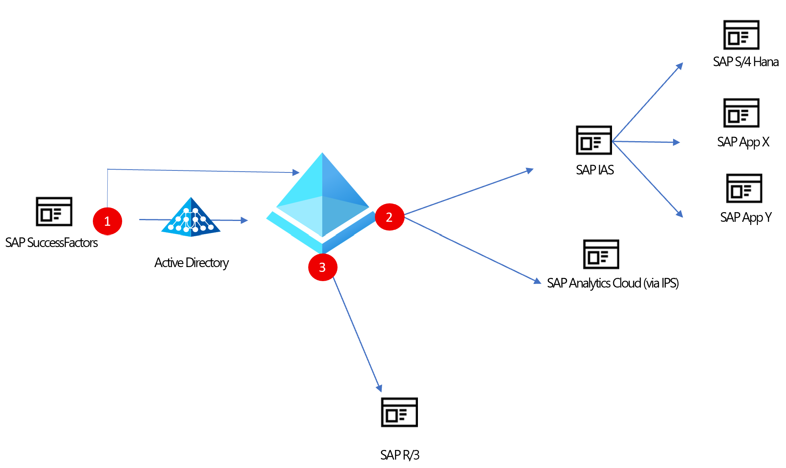
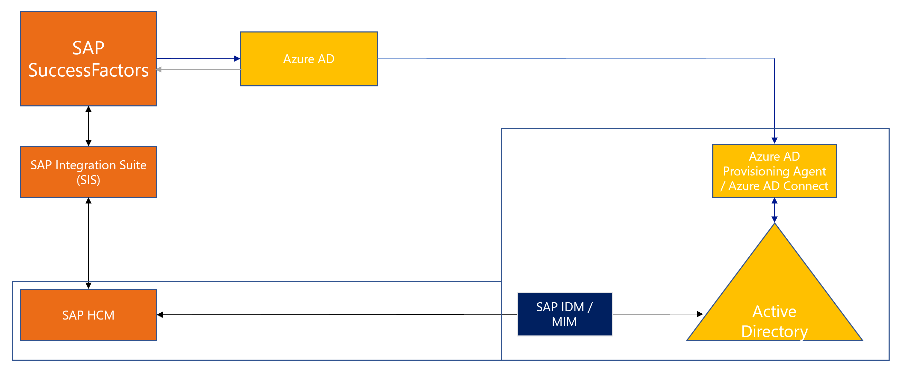

# Manage access to your SAP applications

SAP likely runs critical functions such as HR and ERP for your business. At the same time, your business relies on Microsoft for various Azure services, Microsoft 365, and Entra Identity Governance for managing access to applications. This document describes how you can use Entra Identity Governance to manage identities across your SAP applications. 

## Bring identities from HR into Azure AD

#### SuccessFactors
Customers using SAP SuccessFactors can easily bring identities into [Azure AD](../../active-directory/saas-apps/sap-successfactors-inbound-provisioning-cloud-only-tutorial.md) or [Active Directory](../../active-directory/saas-apps/sap-successfactors-inbound-provisioning-tutorial.md)  using native connectors. The connectors support the following scenarios:
* **Hiring new employees** - When a new employee is added to SuccessFactors, a user account is automatically created in Azure Active Directory and optionally Microsoft 365 and [other SaaS applications supported by Azure AD](../../active-directory/app-provisioning/user-provisioning.md), with write-back of the email address to SuccessFactors.
* **Employee attribute and profile updates** - When an employee record is updated in SuccessFactors (such as their name, title, or manager), their user account will be automatically updated Azure Active Directory and optionally Microsoft 365 and [other SaaS applications supported by Azure AD](../../active-directory/app-provisioning/user-provisioning.md).
* **Employee terminations** - When an employee is terminated in SuccessFactors, their user account is automatically disabled in Azure Active Directory and optionally Microsoft 365 and other SaaS applications supported by Azure AD.
* **Employee rehires** - When an employee is rehired in SuccessFactors, their old account can be automatically reactivated or re-provisioned (depending on your preference) to Azure Active Directory and optionally Microsoft 365 and other SaaS applications supported by Azure AD.

> [!VIDEO https://www.youtube-nocookie.com/embed/66v2FR2-QrY]
 
#### SAP HCM
Customers that are still using SAP HCM can also bring identities into Azure AD. Using the SAP Integration Suite, you can synchronize identities between SAP HCM and SAP SuccessFactors. From there, you can bring identities directly into Azure AD or provisioning them into Active Directory Domain Services, using the native provisioning integrations mentioned above. 
 

## Provision identities into modern SAP applications. 
Once your users are in Azure Active Directory, you can provision accounts into the various SaaS and on-premises SAP applications that they need access to. You've three ways to accomplish this.
* **Option 1:** Use the enterprise application in Azure AD to configure both SSO and provisioning to SAP applications such as [SAP analytics cloud](../../active-directory/saas-apps/sap-analytics-cloud-provisioning-tutorial.md). With this option, you can apply a consistent set of governance processes across all your applications. 
* **Option 2:** Use the [SAP IAS](../../active-directory/saas-apps/sap-cloud-platform-identity-authentication-provisioning-tutorial.md) enterprise application in Azure AD to provision identities into SAP IAS. Once you bring all the identities into SAP IAS, you can use SAP IPS to provision the accounts from SAP IAS into the application when required.   
* **Option 3:** Use the [SAP IPS](https://help.sap.com/docs/IDENTITY_PROVISIONING/f48e822d6d484fa5ade7dda78b64d9f5/f2b2df8a273642a1bf801e99ecc4a043.html) integration to directly export identities from Azure AD into your [application](https://help.sap.com/docs/IDENTITY_PROVISIONING/f48e822d6d484fa5ade7dda78b64d9f5/ab3f641552464c79b94d10b9205fd721.html). When using SAP IPS to pull users into your applications, all provisioning configuration is managed in SAP directly. You can still use the enterprise application in Azure AD to manage single sign-on and use [Azure AD as the corporate identity provider](https://help.sap.com/docs/IDENTITY_AUTHENTICATION/6d6d63354d1242d185ab4830fc04feb1/058c7b14209f4f2d8de039da4330a1c1.html). 

## Provision identities into on-premises SAP systems such as SAP ECC that aren't supported by SAP IPS 

Customers who have yet to transition from applications such as SAP ECC to SAP S/4 Hana can still rely on the Azure AD provisioning service to provision user accounts. Within SAP ECC, you'll expose the necessary BAPIs for creating, updating, and deleting users. Within Azure AD, you have two options:
* **Option 1:** Use the lightweight Azure AD provisioning agent and web services connector to provision users into apps such as SAP ECC.
* **Option 2:** In scenarios where you need to do more complex group and role management, use the [Microsoft Identity Manager](https://learn.microsoft.com/microsoft-identity-manager/reference/microsoft-identity-manager-2016-ma-ws) to manage access to your legacy SAP applications. 

## SSO, workflows, and separation of duties
In addition to the native provisioning integrations that allow you to manage access to your SAP applications, Azure AD supports a rich set of integrations with SAP.   
* **SSO:** Once you’ve setup provisioning for your SAP application, you’ll want to enable single sign-on for those applications. Azure AD can serve as the identity provider and server as the authentication authority for your SAP applications. Learn more about how you can [configure Azure AD as the corporate identity provider for your SAP applications](https://help.sap.com/docs/IDENTITY_AUTHENTICATION/6d6d63354d1242d185ab4830fc04feb1/058c7b14209f4f2d8de039da4330a1c1.html).   
* **Custom workflows:** When a new employee is hired in your organization, you may need to trigger a workflow within your SAP server. Using the [Entra Identity Governance Lifecycle Workflows](lifecycle-workflow-extensibility.md) in conjunction with the [SAP connector in Azure Logic apps](https://learn.microsoft.com/azure/logic-apps/logic-apps-using-sap-connector), you can trigger custom actions in SAP upon hiring a new employee.
* **Separation of duties:** With separation of duties checks now available in preview in Azure AD [entitlement management](https://techcommunity.microsoft.com/t5/azure-active-directory-identity/ensure-compliance-using-separation-of-duties-checks-in-access/ba-p/2466939), customers can now ensure that users don't take on excessive access rights.  Admins and access managers can prevent users from requesting additional access packages if they’re already assigned to other access packages or are a member of other groups that are incompatible with the requested access. Enterprises with critical regulatory requirements for SAP apps will have a single consistent view of access controls and enforce separation of duties checks across their financial and other business critical applications and Azure AD-integrated applications. With our [Pathlock](https://pathlock.com/), integration customers can leverage fine-grained separation of duties checks with access packages in Azure AD, and over time will help customers to address Sarbanes Oxley and other compliance requirements.

## Next steps

- [Bring identities from SAP SuccessFactors into Azure AD](../../active-directory/saas-apps/sap-successfactors-inbound-provisioning-cloud-only-tutorial.md)
- [Provision accounts in SAP IAS](../../active-directory/saas-apps/sap-cloud-platform-identity-authentication-provisioning-tutorial.md)

