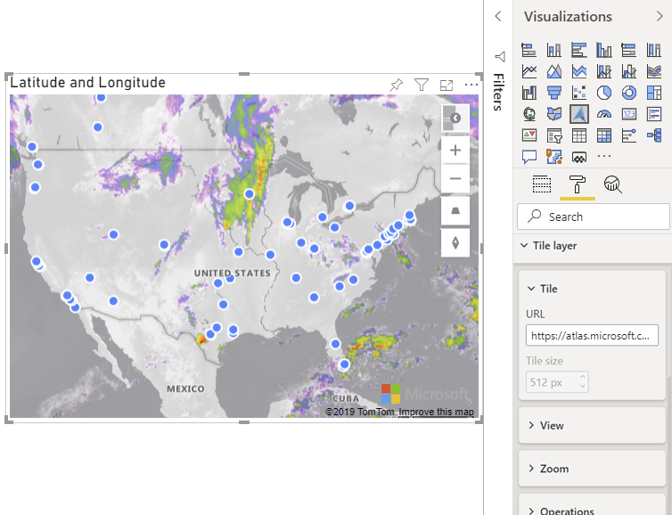

# Add a tile layer

The tile layer feature, like the reference layer feature, allows additional data to be overlaid on the map to provide more context. Tile layers allow you to superimpose images on top of the Azure Maps base map tiles. This is a great way to overlay large or complex datasets such as imagery from drones, or millions of rows of data.

> [!div class="mx-imgBorder"]
> 

A tile layer loads in tiles from a server. These images can either be pre-rendered or dynamically rendered. Pre-rendered images are stored like any other image on a server using a naming convention that the tile layer understands. Dynamically rendered images use a service to load the images close to real time. Tile layers are a great way to visualize large datasets on the map. Not only can a tile layer be generated from an image, vector data can also be rendered as a tile layer too.

The bounding box and zoom range of where a tile service is available can be passed as settings to limit where tiles are requested. This is both a performance enhancement for both the visual and the tile service. Below is an overview of all settings available in the **Format** pane that are available in the **Tile layer** section.

| Setting        | Description   |
|----------------|---------------|
| Url            | A formatted URL pointing to a tile service.  |
| Tile size      | An integer value that specifies both the width and height dimensions of the tiles.   |
| North bound    | Northern latitude of the bounding box where tiles are available. |
| South bound    | Southern latitude of the bounding box where tiles are available. |
| East bound     | Eastern longitude of the bounding box where tiles are available.  |
| West bound     | Western longitude of the bounding box where tiles are available.   |
| Transparency   | Transparency of the tile layer.   |
| Is TMS         | Tile Map Services, a specification that reverses the Y coordinate axis of the tile layer. |
| Min zoom       | Minimum zoom level tiles are available. |
| Max zoom       | Maximum zoom level tiles are available.  |
| Layer position | Specifies the position of the layer relative to other map layers. |

## Tile URL formatting

There are three different tile service naming conventions supported by the Azure Maps Power BI visual:

* **X, Y, Zoom notation** - X is the column, Y is the row position of the tile in the tile grid, and the Zoom notation a value based on the zoom level.
* **Quadkey notation** - Combines x, y, and zoom information into a single string value. This string value becomes a unique identifier for a single tile.
* **Bounding Box** - Specify an image in the Bounding box coordinates     format: `{west},{south},{east},{north}`. This format is commonly used by [Web Mapping Services (WMS)](https://www.opengeospatial.org/standards/wms).

The tile URL an https URL to a tile URL template that uses the following
parameters:

* `{x}` - X position of the tile. Also needs `{y}` and `{z}`.
* `{y}` - Y position of the tile. Also needs `{x}` and `{z}`.
* `{z}` - Zoom level of the tile. Also needs `{x}` and `{y}`.
* `{quadkey}` - Tile `quadkey` identifier based on the Bing Maps tile system naming convention.
* `{bbox-epsg-3857}` - A bounding box string with the format `{west},{south},{east},{north}` in the EPSG 3857 spatial reference system.

As an example, the following is a formatted tile URL for the [weather radar tile service](/rest/api/maps/render-v2/get-map-tile) in Azure Maps. Note that `[subscription-key]` is a placeholder for your Azure Maps subscription key.

> `https://atlas.microsoft.com/map/tile?zoom={z}&x={x}&y={y}&tilesetId=microsoft.weather.radar.main&api-version=2.0&subscription-key={Your-Azure-Maps-Subscription-key}`

For more information on Azure Maps tiling system, see [Zoom levels and tile grid](zoom-levels-and-tile-grid.md).

## Next steps

Add more context to the map:

> [!div class="nextstepaction"]
> [Show real-time traffic](power-bi-visual-show-real-time-traffic.md)
